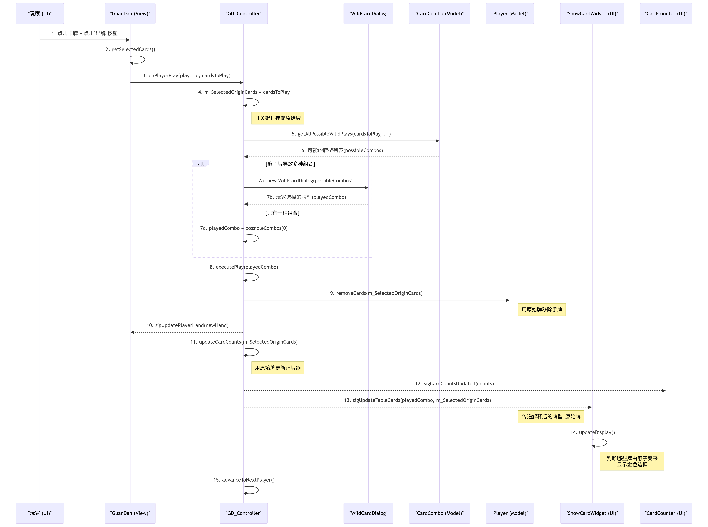

# ♠️ GuanDan    
👉 [English Version](./README-en.md)
##### 本项目由Si-xiyu完成，系华南理工大学24级C++实训作业，仅供学习交流，请勿用于学术造假或商业用途。
##### This project was completed by Si-xiyu as a C++ training assignment for the Class of 2024 at South China University of Technology(SCUT). It is for academic exchange only and should not be used for academic fraud or commercial purposes. 
欢迎报考华南理工大学OwO（）
#### 🃏这个项目应该是在github上能找到完成度最高的基于C++的掼蛋游戏了，如果对你有帮助请点点star~

# 功能介绍
本项目实现了以下任务    
**任务一**

1.  简易图形界面、规则介绍；

2.  随机发牌、确定头家、确定首出玩家；

3.  正确判断牌型、出牌是否符合规则；

4.  简易人机对战（AI有牌就出，默认出最小牌）。

**任务二**

1.  记牌器（需要显示外面的牌还剩几张，以及玩家曾经出过什么牌）；

2.  倍数（分数）计算：每出一个炸弹或同花顺则分数乘以2；

3.  游戏排行榜：正确排出四个玩家的排名

**任务三**

1.  各种参数设置与保存（出牌时间限制、声音大小、开启或关闭声音等）；

2.  出牌提示（提示如何出牌可以大过上一个出牌者）、要不起（即提示玩家没有大过上一个出牌者的牌）等更精巧的交互界面。

3.  更精美的图形界面、声音效果。

# 规则介绍

1.  单牌：牌的大小顺序为：大王、小王、级牌、A、K、…、2.

2.  对子：大小顺序与单牌相同，最大的对子为对大王。

3.  三张牌可以是三不带，也可以是三带一对，但不可以三带一。

4.  四张及以上是炸弹，张数多则炸弹大。

5.  钢板：连续的两组三张牌。例如555666.与斗地主不同，2 可以出现在钢板中，如AAA222和222333.最大的钢板为KKKAAA.

6.  顺子：连续的**五张**单牌。与斗地主不同，2可以出现在顺子中，如A2345和23456.最大顺子为10JQKA.花色相同的顺子为**同花顺**，5炸<同花顺<6炸.

7.  连对：连续的**三个**对子。与斗地主不同，2可以出现在连对中，如AA2233和223344.最大连对为QQKKAA.

8.  癞子规则：**红桃**级牌为癞子，可以替代除大小王以外的任何牌。

9.  升级规则：一二位升三级，一三位升两级，一四位升一级。最后一个出完牌的玩家向第一个出完牌的玩家进贡；进贡的牌为自己手上最大的牌，吃贡的玩家还一张10以下的牌给进贡者。若两张大王同在输家手中，或输家手中没有大过A的牌则不用进贡。

### 进贡与出牌

1. **单下情况**：如果上一局游戏的最后一名（下游）玩家所在的团队没有包揽最后两名，则由下游玩家向上游玩家进贡一张自己手中最大的牌。
    
2. **双下情况**：如果上一局游戏的最后两名（三游和下游）玩家属于同一团队（即双下），则双下方的两名玩家都需要向上游方的两名玩家分别进贡一张最大的牌。
    
3. **抗贡条件**：如果下游玩家手中有两张大王，则可以抗贡，即无需进贡。在双下情况下，如果双下方的两名玩家各自有一张大王，或者其中一人有两张大王，也可以抗贡。
    

### 进贡的牌选择

- 进贡的牌必须是进贡玩家手中最大的单张牌，但红桃级牌（逢人配）除外。
    
- 如果进贡玩家手中没有大王，则进贡最大的单张牌。
    

### 还贡规则

- 接受进贡的玩家需要从自己的手牌中选择一张牌还给进贡者。
    
- 还给己方搭档的牌必须是10以下（含10）的牌。
    
- 还给对方的牌可以是任意牌。
    

### 出牌顺序

- 在单下情况下，进贡者先出牌。
    
- 在双下情况下，进贡大者先出牌，若进贡牌点相同，则按顺时针方向确定出牌顺序。
    
- 如果出现抗贡，则由上游玩家先出牌。
    

这些规则从第二局开始生效，第一局游戏结束后根据玩家的名次确定是否需要进贡

# 软件架构
本项目采用MVC架构，通过GD_Controller类控制游戏主流程。  
**Module**包括Card，Team，Player等用于数据类，以及CardCombo等方法类。
**View**包括CardWidget，PlayerAreaWidget，LeftWidget，GuanDan等类，用于负责视图逻辑。    
### 主要流程图如下
    
    
    

### 各个类的作用详解

#### 一、 模型 (Model) - 游戏数据与核心规则

这部分是游戏的“后台”，定义了游戏世界中的所有对象和规则。

-   `Card.h/.cpp`:
    -   **作用**: 定义了游戏中最基本的单位——**一张牌**。
    -   **核心**: 包含牌的点数(`m_point`)和花色(`m_suit`)。关键方法是 `getComparisonValue()`，它根据当前游戏的“级牌”来计算牌的实际大小，这是掼蛋规则的核心。`isWildCard()` 则用于判断一张牌是否是“癞子”（红桃级牌）。

-   `CardDeck.h/.cpp`:
    -   **作用**: 代表一副或多副**牌库**。
    -   **核心**: `initializeDecks()` 负责创建两副完整的扑克牌（共108张）。`shuffle()` 方法用于洗牌，保证发牌的随机性。

-   `Player.h/.cpp`:
    -   **作用**: 定义了一个通用的**玩家**对象。
    -   **核心**: 存储玩家的基本信息（名字、ID、所属队伍），并管理其手牌(`m_handCards`)。它定义了一个重要的虚函数 `autoPlay()`，为实现AI玩家和人类玩家的差异化行为提供了基础（多态性）。

-   `NPCPlayer.h/.cpp`:
    -   **作用**: 继承自 `Player`，是**AI玩家**的具体实现。
    -   **核心**: `getBestPlay()` 是其AI逻辑的核心，通过一系列 `find...` 辅助函数找出所有能出的牌，然后根据一套预设的策略（如：优先出小牌、少出炸弹）来决定最佳出牌方案。

-   `Team.h/.cpp`:
    -   **作用**: 定义了**队伍**的概念。
    -   **核心**: 将两个玩家组合成一个队伍，并存储队伍共享的状态，如当前级牌(`m_currentLevelRank`)和总积分(`m_score`)。

-   `CardCombo.h/.cpp`:
    -   **作用**: 这是一个非常重要的**静态工具类**，是游戏的“规则引擎”之一。
    -   **核心**: `evaluateConcreteCombo()` 负责判断一手（不含癞子）确定的牌是什么牌型（单张、对子、顺子等）。`getAllPossibleValidPlays()` 是其最复杂的功能，当玩家出牌包含“癞子”时，它会通过递归 (`findCombinationsWithWildsRecursive`) 探索所有可能的组合，并返回所有合法的出牌方式。

-   `LevelStatus.h/.cpp`:
    -   **作用**: 负责管理游戏的**级别状态和胜负进程**。
    -   **核心**: 跟踪并更新两个队伍的级牌。`updateLevelsAfterRound()` 方法根据每局的比赛结果（如“双上”、“一上三下游”）来决定哪个队伍升级、升几级。同时，它还处理打A失败、过A获胜等特殊规则，并判断整个游戏是否结束。

#### 二、 控制器 (Controller) - 游戏的大脑

-   `GD_Controller.h/.cpp`:
    -   **作用**: 项目的**总控制器**，是整个游戏逻辑的指挥中心。
    -   **核心**:
        1.  **状态机**: 使用 `GamePhase` 枚举和 `enterState()` 方法管理游戏的不同阶段（发牌、进贡、出牌、回合结束等），保证了游戏流程的严谨性。
        2.  **事件处理**: 通过`onPlayerPlay`、`onPlayerPass`等槽函数接收来自视图的玩家操作。
        3.  **逻辑调度**: 调用模型类（如`Player`, `CardCombo`）来处理业务逻辑。例如，验证出牌是否合法、从玩家手牌中移除卡牌、更新桌面牌型。
        4.  **视图更新**: 在模型状态改变后，通过发射`sig...`信号（如`sigUpdatePlayerHand`, `sigUpdateTableCards`）来通知视图进行界面刷新。
        5.  **流程控制**: 管理玩家轮转 (`advanceToNextPlayer()`)、计时器、进贡还贡等复杂的流程。

#### 三、 视图 (View) - 游戏的“脸面”

这部分负责所有用户能看到和交互的界面元素。

-   `GuanDan.h/.cpp`:
    -   **作用**: **主窗口 (`QMainWindow`)**，是所有UI组件的容器。
    -   **核心**: 负责初始化整体UI布局，创建 `GD_Controller` 和所有玩家的视图 (`PlayerAreaWidget`)，并通过 `setupConnections()` 将控制器发出的信号连接到对应的UI更新槽函数上。

-   `PlayerAreaWidget.h/.cpp`:
    -   **作用**: 一个**组合控件**，代表一个完整的玩家区域。
    -   **核心**: 它内部包含一个 `PlayerWidget`（用于显示手牌和玩家信息）和一个 `ShowCardWidget`（用于显示该玩家打出的牌）。它根据玩家位置（上/下/左/右）来合理布局这两个子控件。

-   `PlayerWidget.h/.cpp`:
    -   **作用**: **玩家手牌和信息显示区**，是视图层最复杂的组件之一。
    -   **核心**: 负责动态地、美观地展示一个玩家的所有手牌（`CardWidget`），处理卡牌的堆叠、展开、旋转等布局。它还处理玩家对卡牌的点击、选中等交互，并将这些交互转化为信号发送出去。

-   `CardWidget.h/.cpp`:
    -   **作用**: **单张卡牌的视图**。
    -   **核心**: 根据 `Card` 对象的数据，加载并显示对应的牌面图片（或牌背）。它处理自身的选中、悬停高亮等视觉效果，并响应点击事件。

-   `ShowCardWidget.h/.cpp`:
    -   **作用**: 用于在每个玩家区域**显示刚刚打出的牌**。
    -   **核心**: 接收一个 `CardCombo::ComboInfo` 对象，并将其中的牌以清晰的方式展示出来。

-   `LeftWidget.h/.cpp`:
    -   **作用**: 游戏主界面**左侧的信息面板**。
    -   **核心**: 这是一个组合控件，内部集成了 `CardCounterWidget`（记牌器）、`LevelIndicatorWidget`（级牌显示器）、积分榜、排行榜和当前回合信息，集中展示了所有重要的全局游戏状态。

-   `CardCounterWidget.h/.cpp`:
    -   **作用**: **记牌器**的具体实现。
    -   **核心**: 以列表形式显示所有点数（大王、小王、A、K...2）在场上还剩余的数量。

-   `LevelIndicatorWidget.h/.cpp`:
    -   **作用**: 一个小巧的**级牌显示器**。
    -   **核心**: 用两张扑克牌的图像直观地展示双方队伍当前的级牌。

-   **各种对话框 (`...Dialog.h/.cpp`)**:
    -   `WildCardDialog`: 当玩家使用“癞子”出牌且有多种合法牌型时弹出，让玩家**选择具体要出的牌型**。
    -   `TributeDialog`: 在进贡/还贡阶段弹出，让玩家**选择要进贡或还贡的牌**。
    -   `SettingsDialog`: **设置窗口**，允许玩家调整音量、出牌时间等。
    -   `RulesDialog`: **规则说明窗口**，向玩家展示游戏玩法。

#### 四、 工具/辅助类 (Utility/Helper)

这些类提供了独立的功能，被项目其他部分调用。

-   `SoundManager.h/.cpp`:
    -   **作用**: **声音管理器**，采用单例模式。
    -   **核心**: 负责播放背景音乐（BGM）和各种音效（如出牌、点击）。提供了全局的音量控制。

-   `SettingsManager.h/.cpp`:
    -   **作用**: **设置管理器**，静态工具类。
    -   **核心**: 负责将游戏的设置（如音量）保存到本地配置文件 (`.ini`) 中，并在下次启动时加载，实现设置的持久化。

# 开发环境
本项目基于Qt 5.12.5和MSVC环境，由VS2022 + Qt Tool插件开发

# 亮点
采用启发式算法来负责AI出牌逻辑，避免穷举导致的内存过度占用    
MVC架构，各个模块耦合度低，易于实现功能拓展

# 现存问题
- 手牌展示的视图逻辑有问题    
- NPCPlayer类对顺序结构（顺子、钢板、连对）无法加入级牌判断，会影响提示功能和AI出牌功能    
- LeftWidget的视图布局不够合理，HMPlayer中的相关逻辑没有实现（该部分可以实现多名玩家联机对战）    
- 没有在主流程中加入数据库接口。

